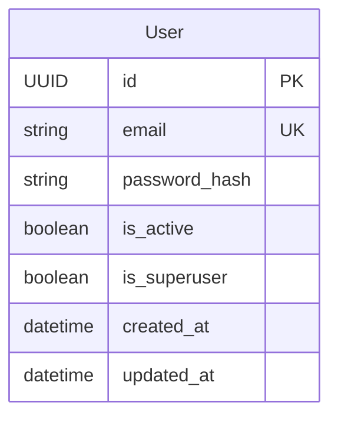

# 資料模型: 使用者驗證

**功能分支**: `006-user-auth`

## 實體關係圖 (ERD)

## 資料庫綱要 (SQLAlchemy Models)

### User Table (`users`)

| 欄位名稱 | 型別 | 限制 | 描述 |
|---|---|---|---|
| `id` | UUID | PK, Default: uuid4 | 使用者唯一識別碼 |
| `email` | String(255) | Unique, Not Null, Index | 使用者電子郵件 (登入帳號) |
| `password_hash` | String | Not Null | 雜湊後的密碼 (Bcrypt) |
| `is_active` | Boolean | Default: True | 帳戶是否啟用 |
| `is_superuser` | Boolean | Default: False | 是否為管理員 |
| `created_at` | DateTime | Default: UTC Now | 建立時間 |
| `updated_at` | DateTime | OnUpdate: UTC Now | 最後更新時間 |

## Pydantic Models (Schemas)

### UserBase
- `email`: EmailStr

### UserCreate (Inherits UserBase)
- `password`: String (min_length=8)

### UserRead (Inherits UserBase)
- `id`: UUID
- `is_active`: Boolean
- `created_at`: DateTime
- `updated_at`: DateTime

### Token
- `access_token`: String
- `token_type`: String (Bearer)
- `refresh_token`: String

### TokenPayload
- `sub`: String (User ID)
- `exp`: Integer (Unix Timestamp)
